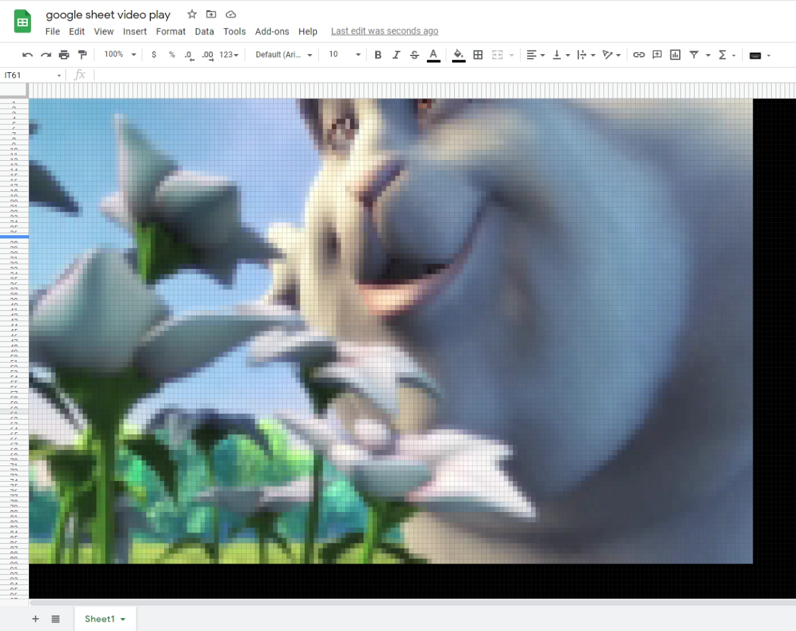

This is a project for fun. A test of playing video on Google Sheets by changing cell colors.

This project is using the famouse video BigBunny. Thank you for the video creators.
https://peach.blender.org/about/

# How to play
- Download BigBunny from [here](http://commondatastorage.googleapis.com/gtv-videos-bucket/sample/BigBuckBunny.mp4) and place the file at `src/video.mp4`
- Set credentials / sheet ID in src/index.ts to manage Google Sheets' cells.
- `yarn`
- `yarn prepare` 
- `yarn start`